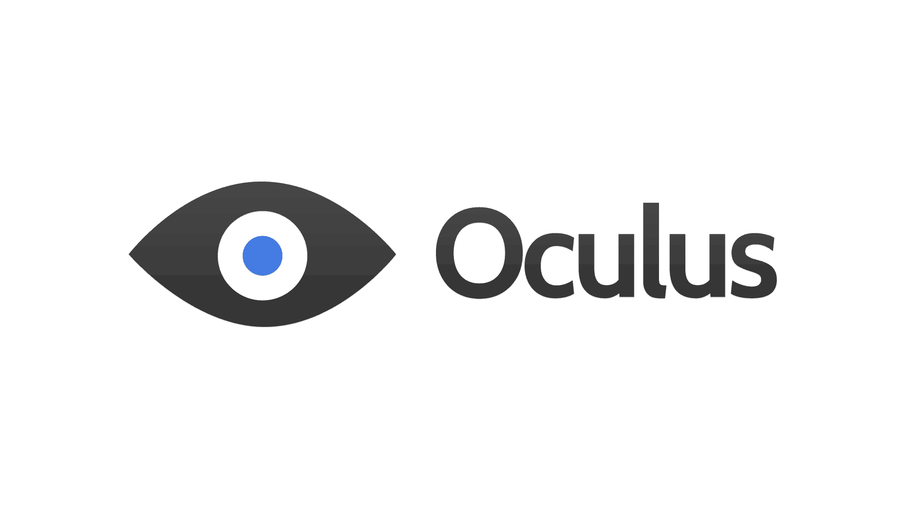
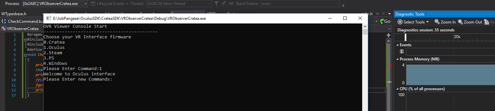
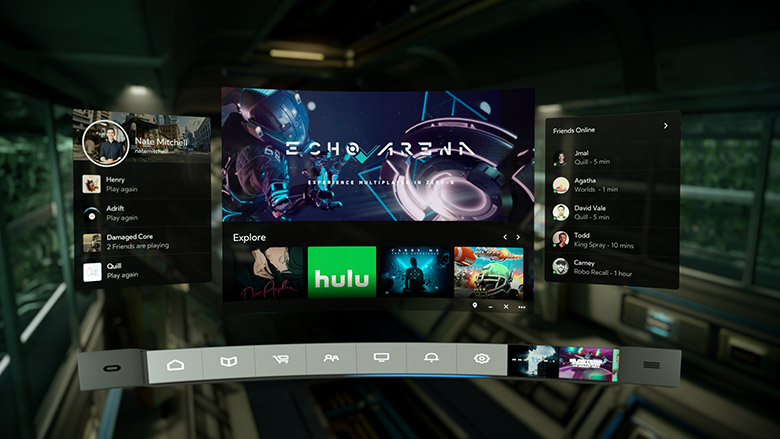

# OculusSDK
OculusSDK for 2018

<a name="toc"></a>
## Table of Contents

[](https://github.com/Pangeae/OculusSDK)



Alpha version



Roadmap
-------

Console control VR devices for Native App. C++, DX
Our most immediate goals are:

- [x] OVR Oculus Library Virtual reality pluged
- [ ] App console interface
- [ ] Implement for Diagnost Vr devices HMD,Inputs,Camera,Gloves,Sensors etc.
   - [ ] HMD
   - [ ] Inputs
   - [ ] Cameras
   - [ ] Gloves
   - [ ] Sensors
- [ ] Designed future plugin with Ovr for Unity3d for fast integration all Sdk DLL's.

[](https://github.com/Pangeae/OculusSDK)

This example initializes LibOVR and requests information about the available HMD.

`Code c++`

```cpp
	// Include the OculusVR SDK
	#include <OVR_CAPI.h>
	void Application()
	{
	   ovrResult result = ovr_Initialize(nullptr);
	   if (OVR_FAILURE(result))
	       return;

	   ovrSession session;
	   ovrGraphicsLuid luid;
	   result = ovr_Create(&session, &luid);
	   if (OVR_FAILURE(result))
	   {
	      ovr_Shutdown();
	      return;
	   }

	   ovrHmdDesc desc = ovr_GetHmdDesc(session);
	   ovrSizei resolution = desc.Resolution;

	   ovr_Destroy(session);
	   ovr_Shutdown();
	}
```

**[⬆ Back to Top](#table-of-contents)**
